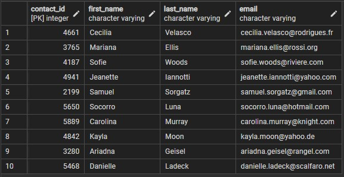
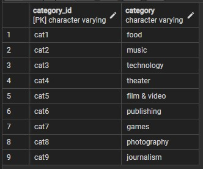
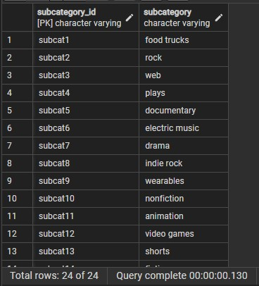
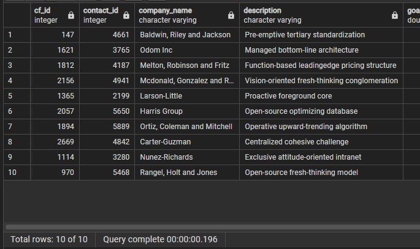

# Crowdfunding_ETL
ETL - Extract Data from Excel file, Transform data, Load data to PostgreSQL database

## Contents
- One `ETL_files` folder containing:
    * An `Archive` folder containing each group member's individual Jupyter Notebook
    * An `Outputs` folder containing the CSVs generated by running the main Jupyter Notebook code
    * A `Resources` folder containing the contacts and crowdfunding excel files
    * A `Screenshots` folder containing jpgs of SQL query results
    * An `ETL_Mini_Project_SKim_VShankar` main Jupyter Notebook with all the Extraction and Transformation code
    * An `entity_relationship_diagram` png file
    * A `crowdfunding_db_schema` PostgreSQL file that creates the tables and imports the CSV data into those tables
- This README.md file

## ETL Steps
This is a broad overview of the ETL Steps:
   - Create the Category and Subcategory DataFrames and export to csv
   - Create the Campaign DataFrame and export to csv
   - Create the Contacts DataFrame and export to csv
   - Create the Crowdfunding Database using the csvs

## Create the Category and Subcategory DataFrames
1. Extract and transform the `crowdfunding.xlsx` Excel data to create a category DataFrame that has the following columns:
    - A "category_id" column that has entries going sequentially from "cat1" to "catn", where n is the number of unique categories
    - A "category" column that contains only the category titles
    - The following image shows this category DataFrame:
    

        

2. Export the category DataFrame as `category.csv`
3. Extract and transform the crowdfunding.xlsx Excel data to create a subcategory DataFrame that has the following columns:
    - A "subcategory_id" column that has entries going sequentially from "subcat1" to "subcatn", where n is the number of unique subcategories
    - A "subcategory" column that contains only the subcategory titles
    - The following image shows this subcategory DataFrame:
          
        
4. Export the subcategory DataFrame as `subcategory.csv`

## Create the Campaign DataFrame
1. Extract and transform the crowdfunding.xlsx Excel data to create a campaign DataFrame has the following columns:
    - The "cf_id" column
    - The "contact_id" column
    - The "company_name" column
    - The "blurb" column, renamed to "description"
    - The "goal" column, converted to the `float` data type
    - The "pledged" column, converted to the `float` data type
    - The "outcome" column
    - The "backers_count" column
    - The "country" column
    - The "currency" column
    - The "launched_at" column, renamed to "launch_date" and with the UTC times converted to the `datetime` format
    - The "deadline" column, renamed to "end_date" and with the UTC times converted to the `datetime` format
    - The "category_id" column, with unique identification numbers matching those in the "category_id" column of the category DataFrame
    - The "subcategory_id" column, with the unique identification numbers matching those in the "subcategory_id" column of the subcategory DataFrame
    - The following image shows this campaign DataFrame:
     
     
      

## Create the Contacts DataFrame

1. Both of the following methods were used to transform the data from the `contacts.xlsx` Excel data:
    - Method 1: Python dictionary methods.
    - Method 2: Regular expressions.

2. Method 1 details:
    - Import the `contacts.xlsx` file into a DataFrame.
    - Iterate through the DataFrame, converting each row to a dictionary.
    - Iterate through each dictionary, doing the following:
        - Extract the dictionary values from the keys by using a Python list comprehension.
        - Add the values for each row to a new list.
    - Create a new DataFrame that contains the extracted data
    - Split each "name" column value into a first and last name, and place each in a new column
    - Clean and export the DataFrame as `contacts.csv`
3. Method 2 details:
    - Import the `contacts.xlsx` file into a DataFrame.
    - Extract the "contact_id", "name", and "email" columns by using regular expressions.
    - Create a new DataFrame with the extracted data.
    - Convert the "contact_id" column to the integer type.
    - Split each "name" column value into a first and a last name, and place each in a new column.
    - Clean and then export the DataFrame as `contacts.csv`
4. This is a preview of the final DataFrame:

## Create the Crowdfunding Database
1. Inspect the four CSV files, and then sketch an ERD of the tables by using [QuickDBD](https://www.quickdatabasediagrams.com/):

2. Use the information from the ERD to create a table schema for each CSV file.
    - Specified the data types, primary keys, foreign keys, and other constraints.
3. Save the database schema as a Postgres file named `crowdfunding_db_schema.sql`
4. Create a new Postgres database, named `crowdfunding_db`.
5. Using the database schema, create the tables in the correct order to handle the foreign keys.
6. Verify the table creation by running a `SELECT` statement for each table.
7. Import each CSV file into its corresponding SQL table.
8. Verify that each table has the correct data by running a `SELECT` statement for each.
    - SELECT * FROM contacts LIMIT 10;          
    
    - SELECT * FROM category;           
    
    - SELECT * FROM subcategory;            
    
    - SELECT * FROM campaign LIMIT 10;          
    
